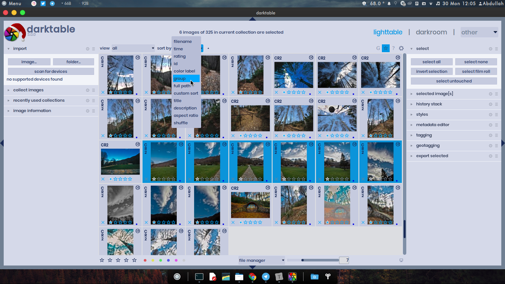
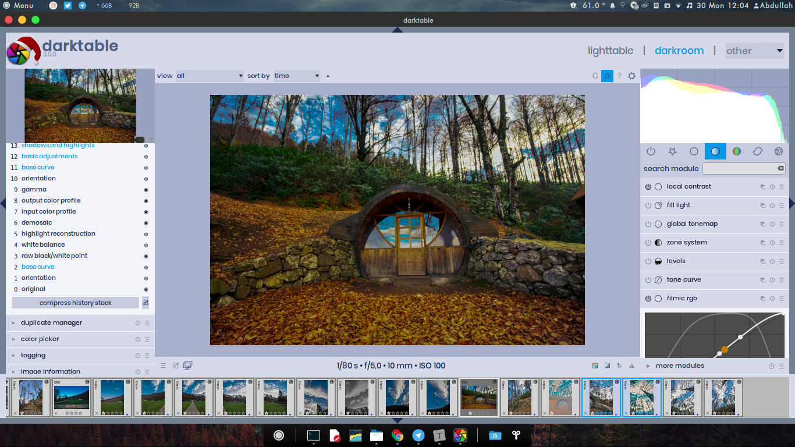
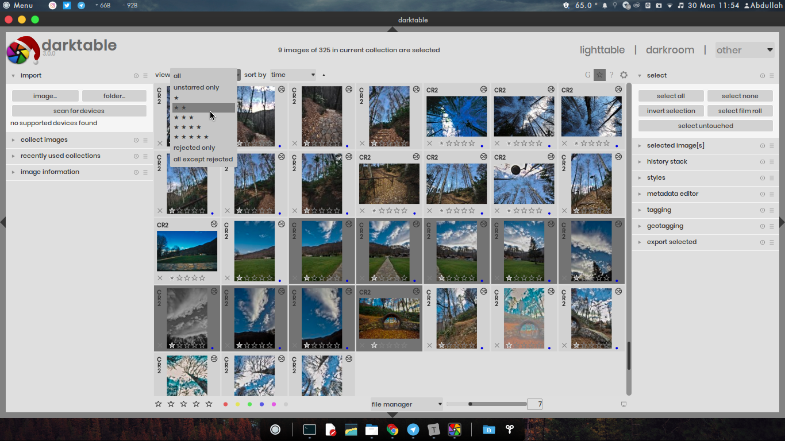
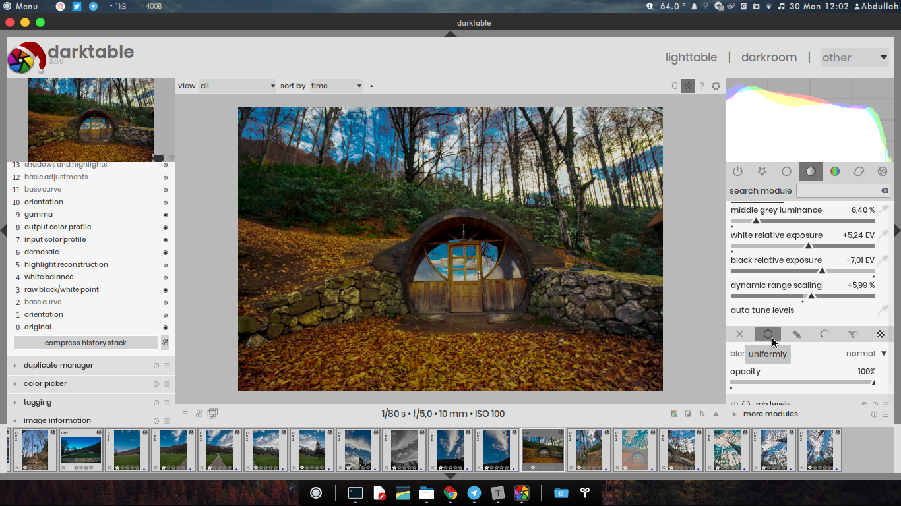

# Light Theme for Darktable 3.0

## Usage

1. Place **`themes`** and **`icons`** folders into `~/.config/darktable` directory.

2. Open Terminal and run these commands to create a link to main themes directory of Darktable.

   `cd ~/.config/darktable/themes` 

   `ln -s /usr/share/darktable/themes/`
   
3. (Optional) Place fonts in in **`poppins-font`** folder to ``~/.fonts` directory.

## Screenshots

### Lightblue

### Light

